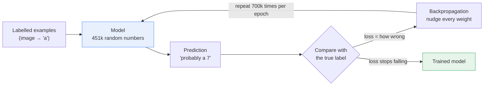
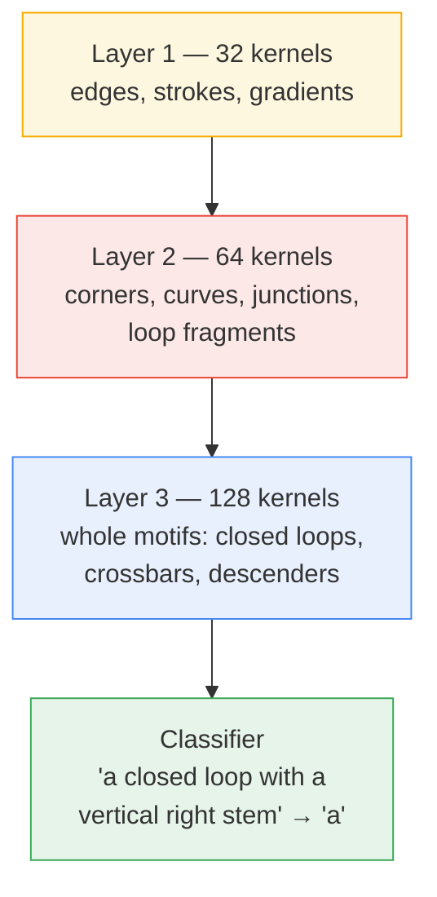
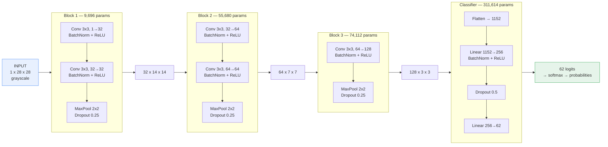
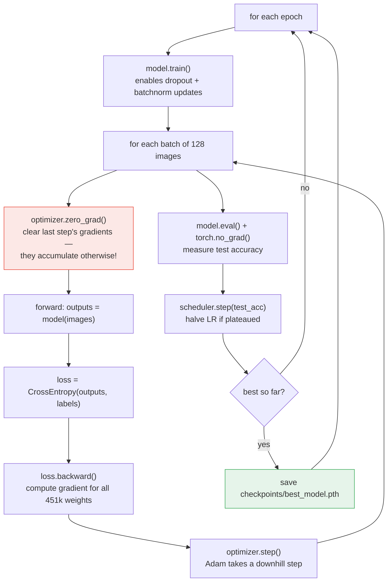
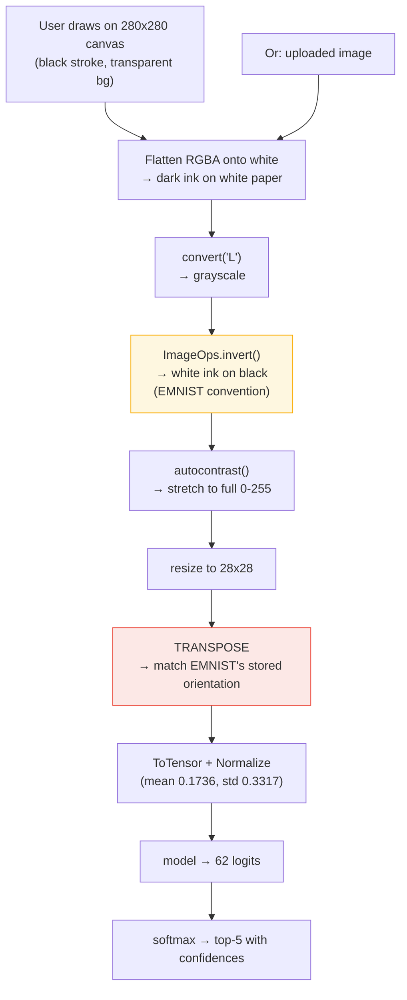

# ML-OCR — Handwritten Character Recognition

A convolutional neural network that recognises handwritten alphanumeric characters — **0–9, A–Z, a–z** (62 classes) — trained from scratch on EMNIST, with a Gradio web UI you can draw into.

| | |
| --- | --- |
| **Dataset** | EMNIST `byclass` — 697,932 train / 116,323 test |
| **Model** | 3-block CNN, 451,102 parameters |
| **Test accuracy** | **86.89%** (best epoch 18 of 20) |
| **Framework** | PyTorch + torchvision, Gradio 6 frontend |

> **On that 86.89%:** it sounds low next to the ~99% you see quoted for MNIST, but this is a much harder problem. MNIST has 10 well-separated digit classes; `byclass` has 62 that include genuinely ambiguous pairs — a handwritten `O`/`o`/`0`, `I`/`l`/`1`, `S`/`s` are often *indistinguishable in isolation*, even to a human, without surrounding word context. Published results on EMNIST `byclass` cluster in the high 80s, so this is roughly at the practical ceiling for a single-character model.

---

## Quickstart

```bash
python -m venv venv
venv\Scripts\activate          # Windows;  source venv/bin/activate on Linux/macOS
pip install -r requirements.txt

python train.py                # downloads EMNIST (~2.2 GB) on first run, then trains
python app.py                  # launches the web UI at http://127.0.0.1:7860
```

The dataset and trained weights are gitignored, so a fresh clone needs one `train.py` run before `app.py` works.

---

## Part 1 — What machine learning is actually doing

A traditional program is a set of rules *you* write. If you tried to write OCR that way you would end up with thousands of hand-tuned rules — "a `7` has a horizontal top stroke and a diagonal descender" — and it would still break on the first person whose `7` has a crossbar.

Machine learning inverts this. You supply **examples with correct answers**, and the algorithm searches for the rules itself.



The three moving parts:

1. **Parameters (weights).** 451,102 numbers, initially random. These *are* the model — training only ever changes these numbers.
2. **Loss function.** A single number measuring wrongness. Here it is cross-entropy, which is small when the model puts high probability on the correct class and large when it is confidently wrong.
3. **Gradient descent.** Calculus gives the *slope* of the loss with respect to every one of those 451,102 weights — i.e. "if I nudge this weight up, does the loss get better or worse?" Every weight steps slightly downhill. Repeat a few million times and the loss settles into a good configuration.

That loop is `loss.backward()` (compute all the slopes) followed by `optimizer.step()` (take the downhill step) in [train.py](train.py#L36-L37).

---

## Part 2 — Why *convolutional* networks

The obvious approach is to flatten the 28×28 image into 784 numbers and feed it to a standard dense network. This works badly, for two reasons:

- **It ignores geometry.** Pixel 100 and pixel 128 are vertically adjacent in the image, but after flattening they are just two arbitrary slots. The network has to *learn* that adjacency from scratch.
- **It doesn't generalise across position.** A network that learned to spot a loop in the top-left has learned nothing about a loop in the bottom-right. Every position must be learned independently.

A **convolution** fixes both. Instead of connecting every pixel to every neuron, you slide a small window — a **kernel**, here 3×3 — across the image. At each position you multiply the 9 pixels by the kernel's 9 weights and sum them into a single output pixel.

```text
INPUT IMAGE (one 3x3 patch)      KERNEL              OUTPUT
                                 (vertical edge
                                  detector)
   0    0   200                                     (0x-1)+(0x0)+(200x1)
   0    0   200        (*)      -1   0   +1    =  + (0x-1)+(0x0)+(200x1)   =  600
   0    0   200                 -1   0   +1       + (0x-1)+(0x0)+(200x1)
                                -1   0   +1
   dark | bright                                   large positive
                                                   -> "vertical edge here!"

Slide that same 3x3 window over all positions -> a full "feature map"
marking every vertical edge in the image.


   +---+---+---+---+---+---+
   | . | . | . | . | . | . |     The window slides one pixel at a time,
   +---+---+---+---+---+---+     left to right, top to bottom.
   | . |###|###|###| . | . |
   +---+---+---+---+---+---+     The SAME 9 weights are reused at every
   | . |###| K |###| . | . |     position -- this is "weight sharing".
   +---+---+---+---+---+---+
   | . |###|###|###| . | . |     Cost: 9 weights instead of 784 per neuron,
   +---+---+---+---+---+---+     and an edge is detected identically no
   | . | . | . | . | . | . |     matter where in the image it appears.
   +---+---+---+---+---+---+
```

The critical insight: **the kernel's 9 weights are not designed by hand, they are learned.** Nobody told the network to build an edge detector — it discovered that edge detection reduces loss. Each layer learns 32, 64 or 128 *different* kernels in parallel, each hunting for a different pattern.

Stack these layers and the features compose into a hierarchy:



Early layers see tiny patches and can only detect primitive things. Deeper layers see the *outputs* of earlier layers, so their effective view of the original image is much larger and their features are correspondingly more abstract. This is why depth matters.

---

## Part 3 — This network, layer by layer

Defined in [model.py](model.py). Every block follows the same recipe: **convolve → normalise → activate → downsample → regularise.**



Notice the trade the network makes as depth increases: **spatial resolution shrinks while channel count grows.** 28×28×1 = 784 values in, 3×3×128 = 1,152 values out. It progressively discards *where* things are in favour of *what* they are — exactly the right trade for classification, where the answer shouldn't depend on the character's exact position.

### What each piece does

| Component | Purpose |
| --- | --- |
| **Conv2d(3×3, padding=1)** | Learns the pattern detectors described above. `padding=1` adds a one-pixel border so the output keeps the same width and height — without it the image would shrink at every layer and the edges would be under-sampled. |
| **BatchNorm2d** | Re-centres each channel's activations to roughly zero mean / unit variance across the batch. Without it, deep stacks suffer from activations drifting to extreme values, which stalls learning. It permits a much higher learning rate and is why this net trains in 20 epochs. |
| **ReLU** | `max(0, x)`. The nonlinearity. Without a nonlinearity between layers, stacked convolutions collapse algebraically into a *single* linear operation, and depth buys you literally nothing. |
| **MaxPool2d(2)** | Takes the strongest response in each 2×2 window, halving width and height. Gives a little translation tolerance ("there was a strong vertical edge *around here*") and cuts computation 4×. |
| **Dropout** | During training, randomly zeroes a fraction of activations (25% in the conv blocks, 50% before the final layer). This blocks the network from over-relying on any single feature and is the main defence against memorising the training set. Automatically disabled at eval time by `model.eval()`. |
| **Linear(1152→256→62)** | The actual classifier. Consumes the feature vector and outputs 62 raw scores (logits), one per class. |

Two dense layers hold 311,614 of the 451,102 parameters — **69% of the model sits in the last two layers.** This is typical: convolutions are extremely parameter-efficient because of weight sharing, while dense layers connect everything to everything.

---

## Part 4 — Training

[train.py](train.py)



| Setting | Value | Why |
| --- | --- | --- |
| Optimiser | Adam, `lr=1e-3` | Adapts the step size per-parameter; robust default that rarely needs tuning. |
| Weight decay | `1e-4` | Mild pull of weights toward zero — discourages over-complex solutions. |
| Batch size | 128 | 128 images per gradient step. Larger batches give smoother gradient estimates and better GPU utilisation. |
| Scheduler | `ReduceLROnPlateau(mode='max', factor=0.5, patience=3)` | Watches test accuracy; if it hasn't improved in 3 epochs, halves the learning rate so the model can settle into a finer minimum instead of bouncing around it. |
| Epochs | 20 | Best result landed at epoch 18. |

**Checkpointing is best-only**: weights are written solely when test accuracy improves, so a late-training overfit can't overwrite a good model.

### Data augmentation

[dataset.py](dataset.py) applies random rotation (±10°), translation (±10%) and shear (5°) to **training data only** — the test set stays clean, otherwise the accuracy number would be meaningless. Each epoch the model sees slightly different variants of every character, which teaches it that a character's identity survives being tilted or shifted, and makes memorising individual images much harder.

---

## Part 5 — Inference

[predict.py](predict.py) and [app.py](app.py). Getting a *drawn* character into the exact format the model trained on is where most of the subtlety lives.



Two steps in that chain are non-obvious and both silently destroy accuracy if you skip them:

**The transpose (red).** torchvision serves EMNIST in the orientation the raw IDX files store, which is the *transpose* of how the character reads — a sample labelled `a` renders as an unrecognisable diagonal smear until you transpose it. The model therefore learned characters in transposed form, so inference must transpose too. Measured on 40 test samples pushed through the full canvas path: **34/40 correct with the transpose, 4/40 without it** — near chance. It is entirely possible to train a great model and get garbage predictions from this one line alone.

**The inversion (amber).** EMNIST is white ink on black. People draw and photograph dark ink on white. `ImageOps.invert` reconciles them — but only if the input genuinely arrives dark-on-white, which is why the canvas RGBA is flattened onto a white background first rather than having its alpha channel read as intensity.

**Normalisation** uses the same mean/std constants as training (0.1736 / 0.3317). Feeding differently-scaled inputs to a network trained on normalised ones is a classic silent accuracy killer.

The model is loaded **once** at import time in [predict.py](predict.py#L11-L16) rather than per-request, and `model.eval()` switches dropout and batchnorm into inference behaviour. Forgetting `eval()` leaves dropout active and makes predictions randomly vary between identical requests.

---

## Project structure

```text
ML-OCR/
├── model.py         OCRNet — the CNN architecture
├── dataset.py       EMNIST loaders, augmentation, class-label mapping
├── train.py         training loop, LR scheduling, best-checkpoint saving
├── predict.py       preprocessing + top-k inference (loads model once)
├── app.py           Gradio UI — draw or upload
├── test_download.py standalone EMNIST download check
├── requirements.txt
├── data/            EMNIST (~2.2 GB, gitignored, auto-downloaded)
└── checkpoints/     best_model.pth (gitignored)
```

`CLASSES` in [dataset.py](dataset.py#L48-L52) defines the index→character mapping the whole project relies on: `0–9` → digits, `10–35` → `A–Z`, `36–61` → `a–z`.

---

## Known issues and ideas

- **Augmentation runs after normalisation.** In [dataset.py](dataset.py#L7-L16) the transform order is `ToTensor → Normalize → RandomRotation → RandomAffine`. The geometric transforms fill newly-exposed border pixels with `0`, but the normalised background value is `(0 − 0.1736) / 0.3317 ≈ −0.523`, so every augmented sample picks up a faint bright frame. The conventional order is augment → `ToTensor` → `Normalize`. Fixing this requires retraining and would likely gain a little accuracy.
- **A Gradio workaround lives in [app.py](app.py#L9-L31).** Gradio decodes the canvas PNG straight off disk and can occasionally read it before the browser finishes writing, raising `UnidentifiedImageError` inside its own preprocess — out of reach of the event handler. The retry is patched onto `gr.ImageEditor` rather than applied via a subclass, because Gradio keys frontend assets off a component's class name and module: any subclass is treated as a third-party custom component and the UI hangs forever fetching bundles that don't exist.
- **`O`/`0` and `I`/`l`/`1` confusions dominate the remaining error.** Single characters in isolation genuinely lack the information to resolve these; a word-level model with context would.
- **No confusion matrix yet.** Per-class accuracy would show precisely where the 13% error concentrates.
